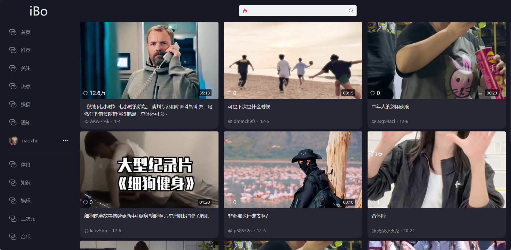

# IBo短视频平台

> 作者：xiaozhu

# 一、项目介绍

IBo是一个Web端短视频应用，致力于为用户提供交互友好、功能完备的短视频浏览体验和弹幕互动体验

- IBo借助七牛云，实现了高效的音视频处理以及存储。
- IBo使用协同过滤算法根据用户之间喜好相似度进行视频推荐，并根据用户的浏览记录不推荐重复视频
- IBo接入星火大模型，通过对视频内容进行语言分析，能够生成视频摘要和标签，实现AI助手自动发布总结评论。
- 前端使用了Vue3语言开发，除了点赞、分享、收藏、评论、主页、分类等众多基础功能之外，IBo还提供了视频弹幕互动、互动消息等特色功能，提高了功能的完备性。
- 前端分类页面中使用了瀑布流的布局，并且支持视频预览；当页面滑动到底部的时候就会加载更多的分类视频
- 后端使用SpringBoot框架，Redis 作为缓存，MySQL进行持久化，同时使用 Elasticsearch 作为搜索引擎，以提供快速而准确的搜索功能；还借助WebSocket实现互动消息的通知；使用RabbitMQ作为消息队列用来异步执行请求，实现服务之间的解耦和流量削峰。
- 对用户上传的视频进行封面截取，用户没有上传封面的情况下利用ffmpeg自动将视频的第一帧作为视频封面

## 模块说明

video-framework（公共模块）：里面包含视频应用前台的后端和视频应用管理系统的后端所需要的依赖，还包括一些公共的类

video（前台后端模块）：里面包含所有视频应用前台的接口，包括视频的点赞、搜索、评论以及收藏等

video-admin（后台管理后端模块）：里面包含所有视频拥有后台管理的接口，包括视频的审核，以及对标签的一系列操作等

## 技术栈

后端：SpringBoot、Mybatis-Plus、Redis、RabbitMQ、ElasticSearch、WebSocket、MySQL等

前端：Vue3、Vuex、Axios、Element-Plus、Danmu等

其他：七牛云存储、星火大模型、Whisper语音识别模型等

## 架构图

## 运行说明

1、首先在数据库管理工具中运行sql文件加下的`video.sql`文件夹

2、将`tools`文件夹Redis压缩包进行解压，解压完成之后找到里面的`redis-server.exe`并双击运行

3、由于ElasticSearch压缩包太大了，所以需要先重网盘中下载下来之后进行解压，并找到bin目录下的elasticsearch.bat双击运行即可

ElasticSearch提取链接：https://pan.baidu.com/s/15V9RITnLx_IueYrT3q3zIg?pwd=s0vi 
						提取码：s0vi

**备注：** 运行ElasticSearch需要jdk环境

4、用IDEA打开video-backend项目，等待依赖加载完成后，分别启动VideoApplication和VideoAdminApplication即可

（要注意的是，Redis、ElasticSearch和MySQL的一些配置都不能出错）

# 二、项目亮点

## 2.1 Whisper + AI 实现视频内容自动总结

当用户上传视频的时候，首先会对上传的视频进行内容提取，如果视频的内容很少，那么就不会进行总结；将提取的内容通过AI进行总结，总结前会给AI一些预设词，按照我们要求的内容格式进行总结，然后将的到的总结进行评论添加，这样用户在浏览该视频的时候就能够快速的了解视频的内容。

图2.1.1 AI视频内容总结时序图

## 2.2协同过滤推荐算法为用户个性化推荐视频

通过建立一张用户视频评分表，当用户在浏览视频的时候进行点赞、收藏、评论等一系列互动行为操作的时候，就会更新用户对视频的喜好程度，然后在为用户推荐视频的时候，首先会筛选出跟当前用户喜好程度相近的几个用户，然后根据这几个用户所喜好的视频为该用户推荐相应的视频；并且推荐的视频会根据用户的浏览记录进行过滤，如果该视频用户已经看过了，就不会进行推荐。

# 三、功能演示

## 3.1 用户登录注册

- 当用户输入登录信息后点击登录按钮，系统将验证其提供的邮箱和密码。
- 如果用户未注册过，可以点击下方的注册按钮跳转到注册页面。在注册页面中需要输入邮箱并填写收到的验证码，点击注册系统会提交对应的注册信息，然后用户就可以用注册好的账户登录系统

图3.1.1 登录页面

图3.1.2 注册页面

## 3.2 视频播放、弹幕功能 

- 用户可以启动视频、暂停视频、拖动进度条、是否循环播放视频、调整视频播放速度、调整视频音量、切换视频播放器显示模式等以满足用户不同的需求和体验
- 弹幕会随着视频的播放而滚动，视频的暂停而暂停

图3.2.1 视频播放页面

## 3.3 视频发布功能

- 用户可以点击导航栏中的“投稿”按钮进入投稿页面。在该页面，用户可以输入投稿视频的描述，上传视频资源（视频封面可选），并选择适合的分类。上传完成后，用户可以点击投稿按钮，完成投稿操作。
- 用户完成投稿后，系统将会将投稿的视频资源上传到七牛云的云端存储，后台会进行审核，以确保投稿内容符合相关规定和准则。
- 如果用户没有上传封面图片的话，系统会自动截取视频的第一帧作为视频封面并上传到七牛云存储空间中

图3.3.1 视频投稿页面

## 3.4 推荐视频与热门视频功能

- 系统实现了视频上下滑动观看功能，用户可以通过三种方式进行视频切换：使用键盘上下键、鼠标滚轮或点击右下角的上下按钮。
- 我们为推荐视频流提供了推荐算法，通过分析用户在刷视频过程中的喜好，会根据协同过滤算法为用户进行视频推荐；并且系统会定期的根据视频的属性（点赞数、收藏数、评论数等）进行权重计算更新热门视频
- 对于已登录用户，他们可以无限滑动浏览视频；而对于未登录用户，系统限制了视频的浏览数量为十条

图3.4.1 推荐视频页面

图3.4.2 热门视频页面

## 3.5 视频分类功能

- 用户可以在系统提供的分类导航中选择感兴趣的视频分类，例如娱乐、体育、知识、二次元等。
- 用户选择对应的分类，系统将会展现该分类下的多条视频内容，并且显示的方式会以瀑布流的形式进行展现，用户将鼠标移动到对应的视频框中还能够进行预览，预览中能拉动进度条以及调整视频音量，能给用户带来更好的体验

图3.5.1 视频分类页面及视频预览功能

## 3.6 视频与用户搜索

- 用户可以通过提交关键词在我们的平台内搜索视频或用户。搜索结果将显示相关视频以及粉丝数靠前的相关用户，并且用户可以通过点击视频封面来观看对应的视频内容。用户还可以点击视频发布者的头像来查看其个人信息。
- 为了方便用户下次搜索，系统会保存用户的搜索记录在输入详情框中，用户下次搜索就可以直接点击对应的关键词就能搜索

图3.6.1 搜索结果页面

## 3.7 点赞视频、收藏视频、分享视频

- 在视频的右侧互动栏中，用户可以点击点赞按钮来给视频点赞，表示对视频的喜爱和支持。同时，用户还可以点击收藏按钮将视频添加到自己的收藏列表中，以便随时回顾和查看。
- 在个人主页中，用户可以方便地查看自己点赞过和收藏过的视频，这样用户可以快速找到自己感兴趣的视频内容，并进行回顾和互动。

图3.7.1 视频互动页面

## 3.8 评论视频、点赞评论、回复评论功能

- 用户可以点击视频右侧互动栏中的评论按钮，即可浏览视频的相关评论。
- 平台使用星火大模型自动生成视频的内容概况，并通过AI小助手发布这条评论。
- 用户可以发布自己的评论，也可以点击对应评论下面的回复按钮来回复别人的评论，增加一点互动行；并且如果是作者评论的话，用户名称右边会显示对应的作者标签
- 用户也可以点赞自己觉得不错的、有帮助的评论表示赞同；并且评论回复的加载不是一次性加载完的，用户可以点击展开更多来查看更多的评论

图3.8.1 视频评论页面	

## 3.9 用户信息展示功能（查看发布、点赞、收藏、历史浏览记录）

- 用户可以在“我的”页面中查看自己发布过的作品，点击作品浏览相应的视频内容，并有权限删除自己发布的作品。
- 用户可以通过切换标签页来查看自己点赞过的视频、收藏过的视频以及浏览过的历史记录，以方便地管理和回顾互动和浏览记录；用户可以点击其他用户的头像来查看TA的作品、点赞和收藏列表
- 用户还能够点击自己的头像来放大查看；在右边有一个编辑资料按钮，用户点击对应按钮就能够修改自己的头像、昵称或者简介

图3.9.1 用户中心页面

图3.9.2 用户信息修改框

## 3.10 用户关系功能（关注视频作者、关注、粉丝、朋友列表）

- 用户可以进入他人的个人主页进行关注或者取消关注操作，还能够看到对方是否和自己是互相关注
- 用户可以在个人中心中查看到对应的关注数、粉丝数以及获赞数；如果查看的是自己的用户中心，还可以点击`关注`或`粉丝`来查看所有自己关注或被关注的用户，还可以通过关键字进行搜索，并且还能看到该用户是否是互相关注

图3.10.1 关注、粉丝用户显示框

## 3.11 消息通知（点赞、收藏、评论等）

- 当用户给别人的视频进行点赞、收藏、评论以及别人回复了自己的评论的时候，如果视频的作者在线的话，那么他就会收到对应的互动消息通知；如果不在线的话，那么就会将消息存储到Redis当中，当作者上线的时候就能看到对应的未读消息数进行互动信息查看
- 如果未读消息数大于99的话，那么会显示99+；并且点击对应的未读消息模块进行查看时，系统会自动将该模块的所有未读信息状态更改为已读
- 用户还可以点击消息框跳转到对应的视频进行查看；如果用户点击的是评论和回复的消息框，那么跳转到对应视频的同时，还会将当前的评论置于顶部并且高亮显示一段时间，以便用户能够很好的查看到评论内容

图3.11.1 互动消息通知

图3.11.2 显示未读消息数

图3.11.3 评论高亮查看

